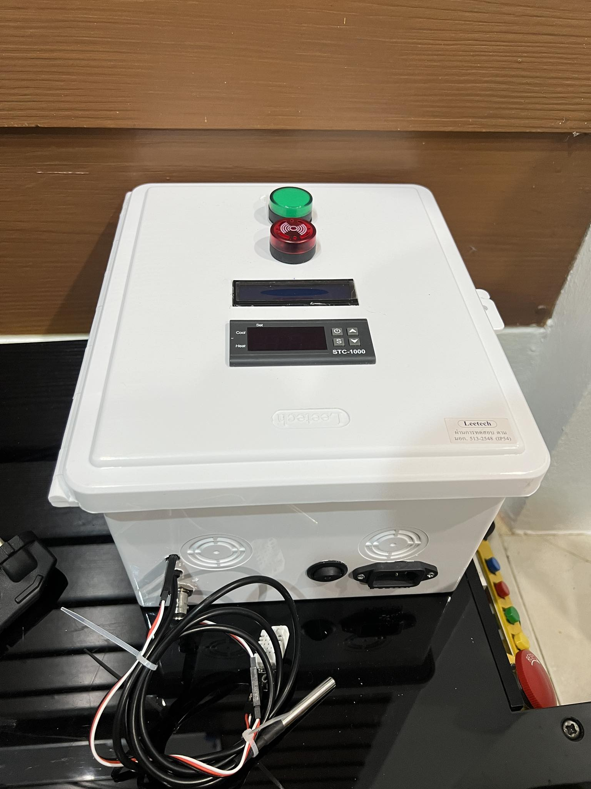

# vrf_water
Arduino Project, Verify Water, (pH, Temperature, Humidty)

# Installation

Library
-  OneWire https://github.com/PaulStoffregen/OneWire
-  DallasTemperature https://github.com/milesburton/Arduino-Temperature-Control-Library
-  DHT22 https://github.com/nethoncho/Arduino-DHT22
-  LiquidCrystal_I2C https://github.com/johnrickman/LiquidCrystal_I2C

# Release / Download

<a href="https://github.com/BossBoxing/vrf_water/releases">Github Release (Click Here)</a>
# About

- Arduino Uno
- DHT22 (Humidity Sensor)
- pH Sensor
- Temperature Sensor

# Photo

